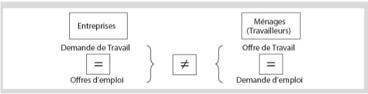
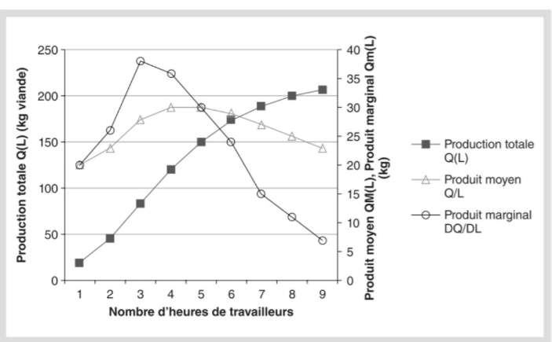
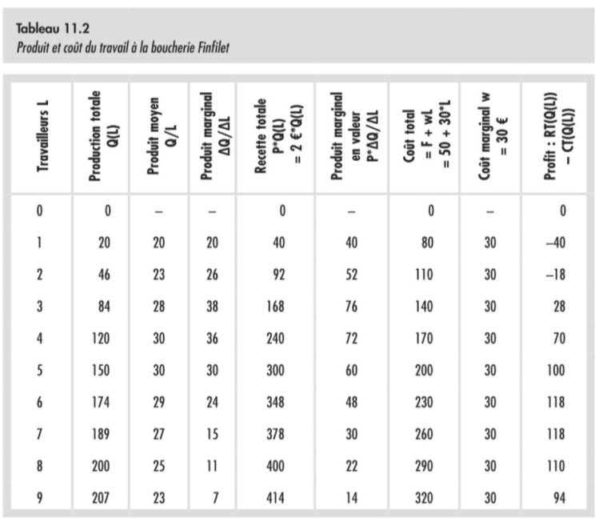
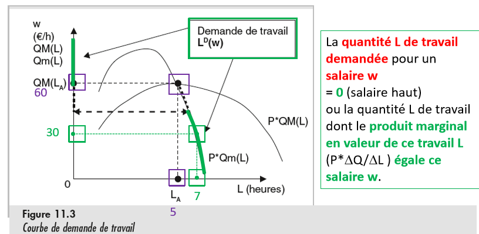
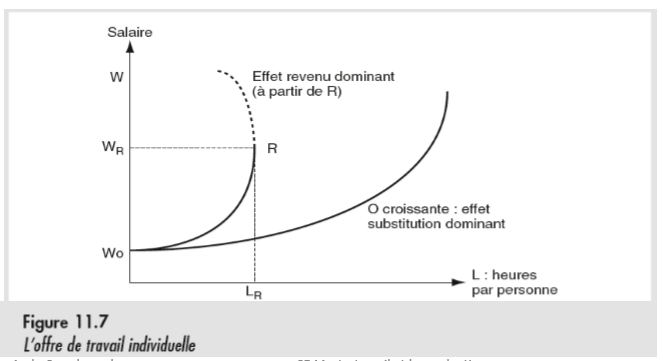
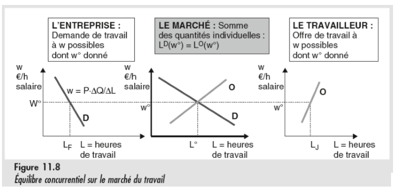
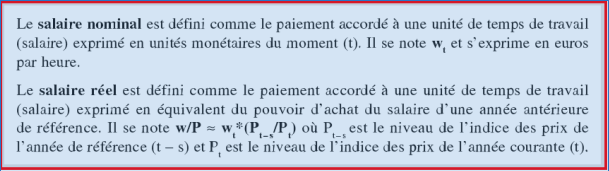
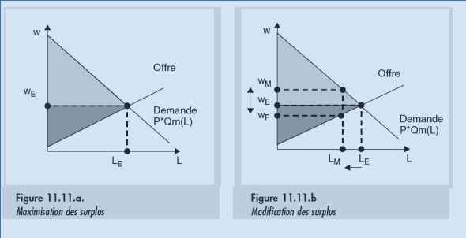
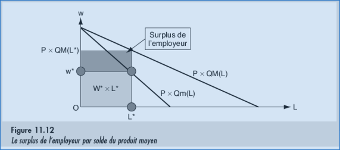

# Chapitre 11 : Travail facteur de production
## Qu'est-ce qu'un facteur de production ?
<table class="table_red">
<td>
Un <b>facteur de production</b> est une ressource qui permet de produire des biens de manière répétée pendant un temps d'utilisation convenu.
</td>
</table>

Il y a une interaction constante entre les marchés des biens et ceux des facteurs de production, étant donné que le facteur de production produit des biens.

### Caractéristiques d'un facteur de production
- ***Le loyer d'usage*** : la quantité de monnaie à payer par unité de temps d’usage du facteur.
- ***Le prix d'achat*** : le montant en monnaie à payer pour obtenir la propriété du facteur et donc la possibilité de l’utiliser librement et autant de fois qu’on le souhaite *(ex : acheter une machine à café automatique)*.
- ***Le revenu*** : le produit du salaire par unité de temps et des unités de temps prestées (sur une période de référence : mois, année…) *(ex : 20h de babysitting à 7€ = 140€)*.

### Le marché du travail
Le marché du travail met en oppsition les demandeurs d'emplois, qui seront ici les **offreurs** de travail, et le offreurs d'emplois qui seront eux les **demandeurs** de travail.

### La fonction de production
<table style="border : 3px solid red; align:center;">
<td>
Une <b>fonction de production</b> est une relation qui associe une quantité produite <i>Q</i> à chaque quantité combinée possible de services de facteurs de production. <i>Q = f(K,L), soit K le capital physique et L la quantité de travail.</i>
</td>
</table>

Il s'agit donc en gros d'une relation qui dénfinit la quantité de travail et de capital investie pour une quantité <i>Q</i>.

## Demande de travail et produit marginal

### Définition

<table style="border : 3px solid red; align:center;">
<td>
La <b>courbe de demande de travail</b> donne la quantité de travail prise par une entreprise, pour chaque niveau de salaire possible, par unité de temps de travail <i>(Tout Autre Chose Egale Par Ailleurs)</i>.
</td>
</table>

Comme d'hab, la courbe est construite dans l'hypothèse qu'un entreprise veut maximiser son profit, en particulier :
- Le prix de vente du bien produit est donné par le marché *(cf Concurrence parfaite)*.
- La quantité K des autres facteurs disponibles dans l'entreprise est constante et représente un coût fixe F.
- Le travail <i>L</i> et la quantité <i>Q</i> sont liés par une fonction <i>Q(L)</i>.
- Le salaire horaire <i>w</i> est donné par le marché du travail et l'entreprise a un plan d'engagement pour chaque salaire possible.

### Construction de la fonction de demande et maximisation du profit
Afin de trouver la fonction de demande de travail, on peut partir de l'hypothèse de maximisation de profit, tel que :
$Profit=P*Q(L) - F - wL$
Cette équation se justifie simplement par le fait que le profit n'est jamais que le produit de la quantité produite et du prix auquel on soustrait les coûts fixes et le coût du travail L.

Afin de maximiser son profit, une entreprise n'embauchera quelqu'un que s'il ajoute plus à la production qu'il ne coûte. On se retrouve alors dans la même logique que dans les chapitres précédents, **le profit est maximal lorsque les coûts marginaux égalent la recette marginale**, en d'autres termes :

$Profit_m ⇒ \frac{d}{dL}(P*Q(L)) = \frac{d}{dL}(wL)$
 
$Profit_m ⇒ P*\frac{d}{dL}(Q(L)) = w$

### Production et produit marginal

#### Produit total, moyen et marginal
- **Le produit total** : Quantité totale d'un bien produit mesuré en quantité physique *(ex : Kg, litres, unités,...)*.
- **Le produit moyen *(ou productivité moyenne)*** : Production totale divisée par le nombre d'heure de travail engagée dans la production.
- **Le produit marginal** : L'augmentation du produit total pour une augmentation d'une heure de travail supplémentaire *En soi, il s'agit donc de la dérivée*.

La mesure la plus importante pour les économistes est le produit marginal en valeur (C'est à dire mesuré en euros).

#### Les phases de rendement du travail

Tout comme les coûts des entreprises dans les chapitres précédents, une société qui emploie fait face à trois phases de rendement:
1. **Phase de rendements croissants** : Phase durant laquelle il est avantageux d'embaucher plus car une heure presté rapporte plus qu'elle ne coûte.
2. **Phase de rendement constant** : Phase durant laquelle une heure de travail prestée rapporte autant qu'elle ne coûte.
3. **Phase de rendement décroissant** : Phase durant laquelle une heure de travail prestée coûte plus qu'elle ne rapporte.

Graphiquement, cela s'illustre comme ceci :

#### Exemple illustratif

Les coûts de production de la boucherie Finfilet sont les suivants, et sont illustrés dans le graphique précédent. On y vois bien les éléments évoqués précédement.

### Demande de travail
La demande de travail s'organise autour du produit marginal, parce que faire ça sur le produit moyen impliquerait de partager l'entièreté des recettes entre les employés, sans pouvoir payer les autres coûts. La courbe de demande correspond donc au Produit marginal moyen en valeur, lorsque celui-ci est inférieur au maximum de coûts moyens. *(Bah oué, au delà tu payes un ouvrier plus qu'il ne te rapporte)*. Au delà de ce point, l'offre vaut 0. Mais on remarquera une marge en pointillé entre la courbe de demande et le maximum de coût moyen. Engager jusque ce point là impliquerait de lancer tout les revenus du magasin dans la paye des employés. C'est pourquoi on enbauche un peu en dessous, pour garder un peu et pouvoir prendre payer des gens en urgence s'il le faut.

### Demande collective

Il s'agit de la somme des demandes de chaque entreprise, et a l'avantage d'être plus élastique que la demande individuelle, c'est à dire qu'elle possède une pente plus forte.

## Offre de travail

<table style="border : 3px solid red;">
<td>
<b>La courbe d'offre de travail</b> donne la quantité de temps de travail fournie par les travailleurs, pour chaque niveau de salaire possible, par unité de temps de travail.
</td>
</table>

 

On constate deux effets liés quant à l'offre de travail:
- *L'effet de substitution* : Lorsque la hausse des salaires donne un incitant à un travailleur pour céder du temps en échange d'argent, le loisir devient alors "couteux" car il implique de laisser tomber un certain salaire.
- *L'effet de revenu* : Lorsque le salaire atteint un certain niveau, il est possible de voir le travailleur diminuer son temps de travail afin de gagner du temps de loisir. Le salaire ayant atteint une valeur conséquente, le travailleur peut se permettre de perde des heures de travail sans que ce soit problématique pour lui.

### Offre collective
Comme d'habitude, il s'agit de la somme des disposition à travailler de chaque travailleur. L'élasticité y est comme toujours plus élevée que dans les courbes individuelles. Il y a aussi une tendance à avoir une offre infiniment élastique à salaire bas *(A cause des polonais qui travaillent pour 3 verres d'eau de l'heure ?)*, combattue dans les pays industrialisés mar un salaire minimum.

## Equilibre en concurrence parfaite
<table style="border : 3px solid red;">
<td>
<b>L'équilibre concurrentiel</b>  est atteint lorsque le salaire <i>w</i> est tel que le quantité de travail <i>L(Demande)(w(Offre))</i> demandée par l'ensemble des entreprises est égale à la quantité de travail <i>L(Offre)(w(Demande))</i> par l'ensemble des travailleurs. <i>En gros, quand les deux courbes se croisent...</i>
</td>
</table>

 

### Nuances à l'équilibre concurrentiel

Les conditions du marché à l'équilibre sont rarement remplies dans le cas du marché du travail :

- **Homogénéité** : Ce critère suppose que le marché du travail soit un marché unique où tout les travailleurs sont substituables les uns aux autres. C'est bien évidemment impossible au vu de la multitude de corps de métiers existant aujourd'hui. Et à cela ce rajoute des différences artificielles *(Des discriminations)* entre certains travailleurs.
- **Atomicité** : Un travailleur aux compétences uniques ne prend pas nécéssairement le prix du travail fixé par le marché comme donné. Il est justement en position de négociation, tout comme des travailleurs qui s'unissent en syndicat. La même chose est possible pour la demande qui peut profiter d'être le seul demandeur d'un travail proposé par beaucoup de personnes pour faire chuter le prix du salaire.
- **Mobilité** : Beaucoup de contrats sont de longue durée, ce qui réduit la mobilité des agents du marché.
- **Information parfaite** : Un employeur ne peut pas être certain des compétences de quelqu'un qu'il emploie.
- **Marchés complets** : Ce critère suppose que les employeurs et les employés pourraient régler à l'avance toutes les activités et tous les revenus des uns et des autres. Ce n'est évidemment pas le cas, notamment pour les employeurs qui ne peuvent pas avoir la garantie que leur employé va rester dans l'entreprise après lui avoir payer une formation, ect...

### Salaire nominal & salaire réel

Le salaire d'un employé pouvant varier suite aux mouvements des courbes d'offre et de demande en fonction des différents chocs qu'un marché pourrait rencontrer, il est intéressant de différentier deux *vision* du salaire:

### Les surplus

Comme vu jusqu'ici, le marché à l'équilibre en concurrence parfaite maximise les surplus, mais comme vu lors des nuances de l'équilibre concurrentiel, chaque partie peut essayer d'augmenter son profit au détriment de celui de l'autre :

#### Une autre représentation des surplus

Le surplus de l'employeur peut être calculé comme la différence entre le salaire payé et le salaire qu'il était prêt à payer pultiplié par le nombre d'heures concernées.

