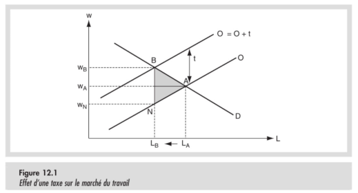
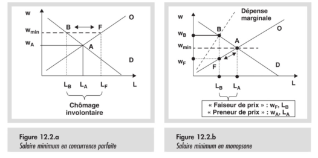
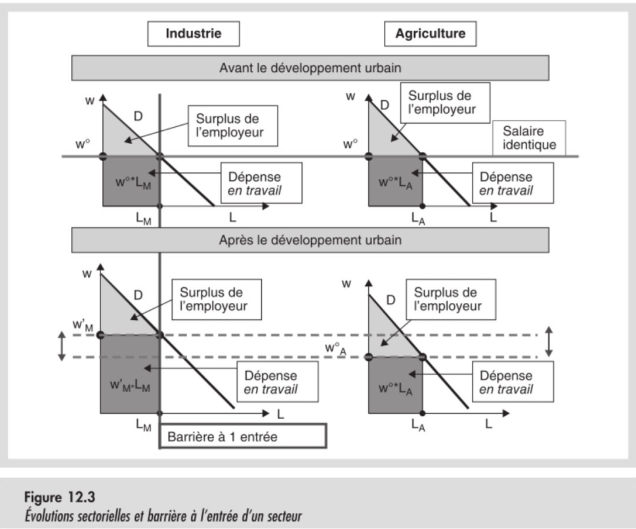
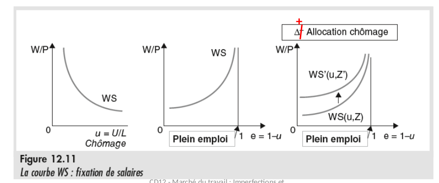
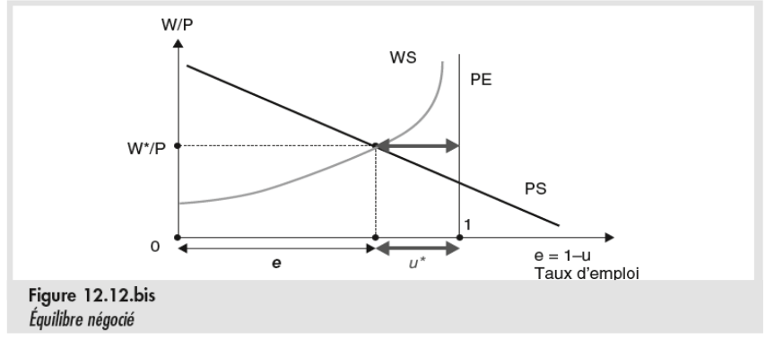
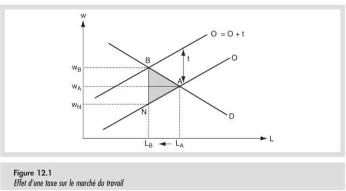
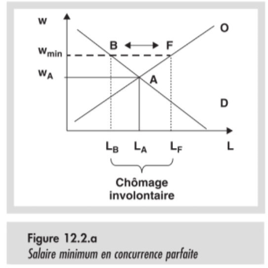
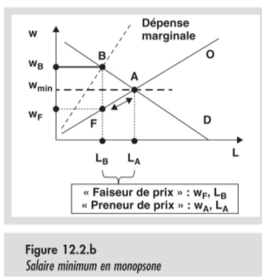

# Chapitre 12 : Imperfections du marché du travail

<!--
## Introduction d'Alain

### Salaires en Belgique

1. Loi sur la compétitivité 1956, 2016
2. Indexation
3. $w_t = W_{t-1}\frac{P_t}{P_{t-1}}$
4. 4,5 - 2,8 = 3,7 %
5. Productivité
6. Janvier 2019 : 0,8 %
7. Négocié : 1,1 %
-->

## Les types de chômage

<table style="border : 3px solid red; align:center;">
<td>
<b>Chômage involontaire : </b>personne qui souhaite travailler, offrir du travail au salaire en vigueur, observé sur le marché, et ne trouvent pas de travail.
</td>
</table>
 
<table style="border : 3px solid red; align:center;">
<td>
<b>Chômage structurel</b> : Chômage résultant de l'organisation des marché, individuellement involontaire
</td>
</table>

 
<table style="border : 3px solid red; align:center;">
<td>
<b>Chômage Frictionnel</b> : Passage d'un travail à un autre, <i>temps de conversion ?</i> Il s'agit de chômage temporaire
</td>
</table>
 
<table style="border : 3px solid red; align:center;">
<td>
<b>Chômage Conjoncturel</b> : Chômage résultant de l’organisation du marché Peut être collectivement volontaire mais individuellement involontaire.
</td>
</table>

## Chômages

Sur le graphique habituel où le croisement entre l'offre et la demande définit la quantité et le prix d'équlibre. Visiblement, le salaire n'est pas le salaire d'équilibre, ce qui crée un chômage involontaire.

Dans le cas d'une offre infiniment élastique, qui peut être causé par la possibilité de retomber sur une allocation de chomâge et tout les avantages qui peuvent venir avec. Dans ce cas, il y a un chômage involontaire presque inévitable car la quantité de travailleur à un prix donné est théoriquement infinie alors que la demande, est elle définie et embauchera une quantité précise de travailleurs.

## Introduction

Le marché du travail souffre d'imperfections qui l'éloignent de l'équilibre de concurrence parfaite et le rendent moins efficace. Tels que :

- **Le chômage involontaire** : personne qui souhaite travailler, offrir du travail au salaire en vigueur, observé sur le marché, et ne trouvent pas de travail.
- **Le sous-emploi** : Personne qui pourraient travailler et ne travaillent pas ou sont sous-utlilisés
- **Discriminations** : Traitement différent de personnes pour des tâches équivalente ou accès limité à des professions sur base de critères non pertinents
- **Différences entre le salaire net et le salaire brut** perçues comment excessives et assorties de débats sur la logique assurancielle ou fiscale des charges sur le travail
- **Frustration des travailleurs et des entreprises** sur le manque de mobilité entre activités et entre entreprises et sur le manque de flexibilité des horaires et des charges de travail.

Il s'agit ici de plusieurs exemples, il y en a bien plus.

## Interventions sur les marchés

### Taxes

COmme d'habitude, l'introduction d'une taxe sur un marché à l'équilibre provoque une perte sèche provoquée par le déplacement de la courbe d'offre et réduit donc le nombre de personnes employées. Il ne s'agir cependant pas de chômage involontaire car toute personne disposée à travailler trouve un travail, ceux qui ne trouvent pas d'emploi sont ceux qui trouvent la rémunération du travail proposée insufisante.

### Salaire minimum

L'instauration d'un salaire minimum, quant à elle, provoque du chômage involontaire. Comme montré sur le dessin, certaines personnes qui sont prêtes à travailler ne sont pas embauchées.

Ce même salaire minimum peut être bénéfique dans le cas d'un monopsone qui fonctionnerait principalement sur base de travailleurs à temps partiel voir même payés à l'heure. Il limite alors le pouvoir du monopsone en le forçant à reconsidérer sa courbe de coûts et d'en définir un nouveau salaire $W_F$ qui sera inférieur au salaire d'équilibre et qui limitera donc son pouvoir d'embauche.

## Pouvoirs de marché

- **Monopole** : Le monopole sur le marché du travail est le même que sur celui des biens. L'employé ou son syndicat, seul offreur, fait monter le salaire le long de la courbe de demande de travail, mais réduit la quantité de travail
- **Monopsone** : Étant donné le pouvoir du Monopsone sur les prix, il choisira le prix qui rentabilise au mieux son profit en s'en foutant du reste. D'où l'intérêt d'un salaire minimum
- **Négociation** : Lorsque employeurs et employés discutent du salaire et du travail, le pouvoir de négociation de chacun dépend du chômage (Plus il y a de chômage, moins les employés ont de pouvoir), de marges de profit, d'alternatives d'emploi ou d'allocation et pensions. Cette négotiation peut améliorer l'efficacité et l'équité mais peut se faire au dépends de tiers (consommateurs, travailleurs non-protégés, ect...)

## Répartition des travailleurs entre activités

Dans cet exemple, on peut y voir la demande et l'offre de l'industrie et de l'agriculture avant et après le développement urbain. L'offre de travail industriel post-développement étant plus élevée que l'offre agricole, il pourrait être tentant pour un agriculteur de changer d'activité. Dès lors, on peut déterminer 4 catégories qui on une appréciation différente de la mobilité de ce travail :

La mobilité du travail c'est :

/ | Agriculture | Industriel
---|-------------|-----------
Employeurs | Pas cool | Cool
Travailleurs | Cool | Pas cool

### Production totale et surplus

Plus le nombre de personnes employées est élevé, moins l'apport d'un employé supplémentaire sera important. Comme le montre le graphique.

### COmment faire monter les salaires ?

- La concurrence entre employeurs
- Nouveaux métiers (informatique)
- Hausse de productivité
- Lutte contre le monopsone sur le marché du travail
- Lutte du monopsone sur le marché des biens
- Résistance des détenteurs de pouvoirs de marchés

## Négociaton collective

### La courbe de fixation des salaires

Dans le cas d'un chômage bas, le pouvoir de négociation des travailleurs est accru, car les employeurs ne pourront pas facilement trouver quelqu'un d'autre.

Une allocation de chômage permet de négocier un salaire plus élevé, car ça ne sert plus à rien de payer quelqu'un en dessous du prix d'allocation.

Le salaire d'équilibre dépend d'un *Price Setting* ($P_s$).

La courbe WS révèle une accélération du salaire près du plein emploi :
- Les employeurs veulent motiver par les hauts salaires et par la crainte du chômage,
- Les travailleurs gagnent (collectivement) davantage à la hausse du salaire qu’à l’embauche du travailleur marginal.

<!--
## Notes de la vidéo
La france est soumise à un chômage structurel, 'est à dire indépendant de l'activité économique. Il serait d'avantage lié à d'autre facteur que la délocalisation

⇒ Peut être le manque de flexibilité, ou l'incapacité de répondre aux demandes des entreprises.

Pour lutter contre le chomage ? Valoriser les fillières qui recrutent et favoriser le changement de carrière

ENsuite chômage conjonturel

DIminuer les impôts pour favoiser la consommation des ménages.

Diminuer le coût du travail, en diminuant les charges sociales et les augmentation de salaire

# Corbeille

## Taxes

Comme vu dans les chapitres précendents, une taxe introduite sur un marché provoque la création d'une perte sèche qui se traduit par une baisse de la quantité de travail presté par rapport à l'équilibre concurrentiel sans taxes

Il ne s'agit par contre pas de *chômage involontaire*, car toutes les personnes prêtes à travailler sont embauchées.

## Salaire minimum

L'instauration d'un salaire minimum contraignant, c'est-à-dire suppérieur au salaire d'équilibre, provoque du chômage involontaire. En effet, dans ce cas, il y a plus de travailleurs prêt à travailler que d'heures que les employeurs sont prêt à prester.

Par contre, dans le cas d'un *monopsone*, l'utilisation d'un salaire minimum peut être intéressante pour réduire le pouvoir de ce dernier sur le marché. Étant donné que le *monopsoneur* peut manipuler les prix du marché, utiliser un salaire plancher empêche le salaud de capitaliste de descendre de dessous :

-->
