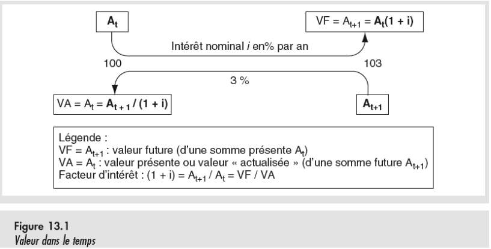
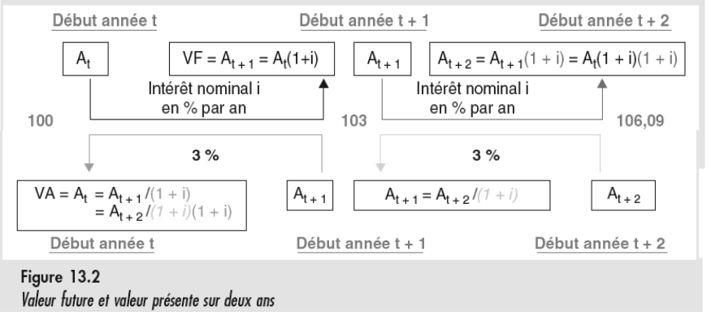
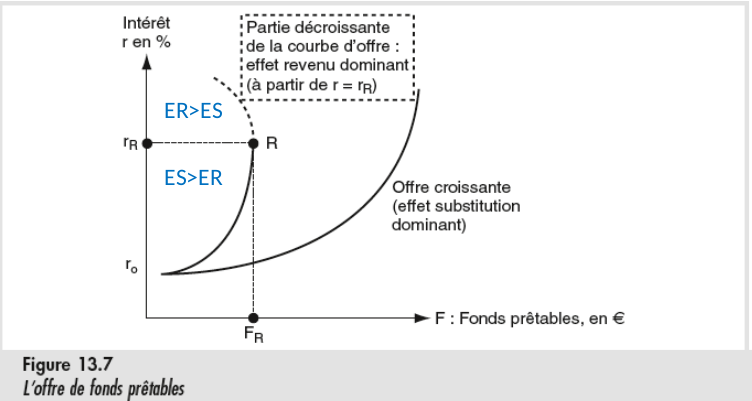
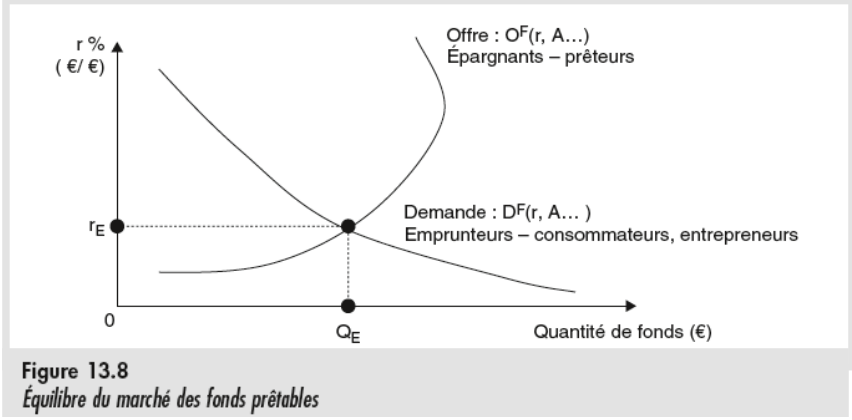

# Marché des fonds prêtables et prix du temps

## Le capital

*Origine du mot* : Romain, désignant la tête de bétail, qui était le symbole de richesse de l'époque.

## Prix du temps

Il est préférable d'avoir une somme donnée maintenant plutôt que plus tard. Parce que :
- On pourrait crever d'ici là
- Les prix pourrait augmenter d'ici là
- Cela donne plus de liberté pour investir, épargner, ect...

C'est cela qui a un prix lors d'un prêt, et qui explique l'existence d'intérêts

## Intérêts simples

$V_F = V_A(1 + i) \Leftrightarrow V_A = \frac{V_F}{(1 + i)}$

- La **Valeur actualisée** est le montant que l'on peut emprunter au temps t en échange de la cession du montant futur Y au temps t + s
- La **valeur future** est le montant qu'on peut obtenir au temps t + s en échange du dépôt immédiat de ce montant

## Intérêts composés

$Y_{c, t+n} = Y(1 + i)^n$

## Composantes du taux d'intérêt

Facteurs d'inflation : $\frac{P^{e}_{t+1}}{P_t} = (1 + \Pi^e)$

Facteur d'intérêt réel : $1 + r^e = \frac{Q^e_{t + 1}}{Q_t}$

Facteur d'intérêt npminal : $\frac{VF}{VA} = (1 + \Pi^e)(1 + r^e) = 1 + i$

Décomposition de Fischer : $i = r + \Pi^e + r\Pi^e  = r + \Pi^e$ (Approximation car $r\Pi^e$ est négligeable)

Prime de risque : Taux supplémentaire, généralement à la tête du client, dépendant de si le prêteur juge qu'il y a un risque de manquement de la part de l'emprunteur.

## Demande de fonds prêtables

### Demande de consommation

#### Contrainte de budget

Sans épargne, il n'est possible de consommer que ce qu'on possède à l'instant t. Si on ne gange rien à l'instant t + 1, alors je ne consomme rien

$C_t = A_t$ et $C_{t + 1} = A_{t+1}$

Et si je peux emprunter :

$C_t = A_t + E_t$ et $C_{t+1} = A_{t+1} - E_t(1 + r)$

$\frac{C_t + C_{t+1}}{1 + r} = A_t + \frac{A_{t+1}}{1+r} = B$

Un prêt peut être intéressant pour avoir un revenu plus stable $\Leftrightarrow$ *Lissage*

#### La demande de production

Demande de prêt pour financer une production : Louer l'argent pour acheter l'équipement plutôt que de louer l'équipement K

#### Courbe de demande

## Offre de fonds prêtables

### L'épargne

Il s'agit du même principe que celui du prêt décrit dans la contrainte de budget, sauf que l'intérêt y est négatif

### Courbe d'offre

## Equilibre du marché

Ce marché génère bien des gains d'échanges, des surplus

### Théorie de la croissance

Il est complètement con de promettre un taux de remboursement en biens suppérieur à la production du dit bien.
