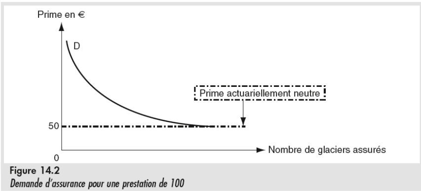

# Marché de l'assurance et prix de la sécurité

## Risque et prix de la sécurité

### Volatilité du revenu

<table class="table_red">
<tr>
<td>Le <b>risque</b> est une incertitude sur le futur, due à des aléas incontrôlables</td>
</tr>
</table>
<table class="table_red">
<tr>
<td>Un <b>état du monde</b> est un évènement futur possible, mais incertain</td>
</tr>
</table>
<table class="table_red">
<tr>
<td>Une <b>loterie</b> est un revenu qui prend des valeurs différentes selon les états du monde</td>
</tr>
</table>

Une bonne manière de calculer la variation de revenu : **L'écart-type**

$ET = \sqrt{\sum P_i(x_i - x')²}$.

$x_i$ = Le revenu
$x'$ = le revenu moyen
$P_i$ = Probabilité du revenu

## Revenu attendu et aversion au risque

<table class="table_red">
<tr>
<td><b>L'aversion au risque</b> se définit comme la disposition à accepter une baisse de revenu attendu en échange d'un gain de stabilité du revenu</td>
</tr>
</table>

### Le contrat d'assurance

- **Prime** : Montant payé par l'assuré à l'assureur dans tous les états du monde
- **Prestation** : Montant reçu par l'assuré de l'assureur dans un certain état du monde, selon le contrat d'assurance
- **Contrat acturiallement neutre** : est fait d'une prime et d'une prestation qui laissent le revenu attendu de l'assuré inchangé (le montant de la prime = valeur attendue de la prestation) et réduisent le risque.

Le meilleur assureur pour une activité est quelqu'un dont les revenus varient inversément en fonction des états du monde. *Le meilleur assureur pour un vendeur de lunettes de soleil est le vendeur de parapluie*

## Demande d'assurance

- Le **revenu attendu** d'une loterie $E(R)$ est la somme des revenus R possibles pondérés par la probabilité *p* que *chaque revenu* se réalise :

$E(R) = \sum_{i = 1}^{n}{P_i*R_i}$

- La satisfaction attendue d'une lotterie $E(U(R))$ est la somme des satisfactions U(R) retirées de chaque revenu R possible, pondérés par la probabilité p que chaque niveau de satisfaction se réalise :

$E(U) = \sum^n_{i=1}p_i*U(R_i)$

Dans le cas de l'aversion au risque, la satisfaction attendue d'un revenu certain est supérieure à la satisfaction attendue d'un revenu attendu incertain de même montant

Au niveau de la prime acturialement neutre, tout le monde s'assure car cela ne coûté rien et réduit l'incertitude.

## Offre d'assurance

Ici, personne n'assure au niveau de la prime acturiellement neutre, car cela ne rapporte rien.

## Equilibre du marché

- Gains de l'échange :
- Assuré *à risque* acquiert de la stabilité en échange de revenu
- Assureur *stable* acquiert du revenu en échange de volatilité
- Surplus :
- **Surplus de l'assuré** : différence entre disposition à payer et prime de marché
- **Surplus de l'assureur** : différence entre prime requise *(actuariellement neutre)* et prime du marché

Plus un acteur est diversifié, moins il est sensible au risque (Un vendeur de parapluie et de lunette de soleil en fonction de la météo est moins victime des aléas des états du monde)

## Evaluation des titres financiers

**Je n'ai pas bien compris cette partie, vous êtes les bienvenus pour combler ce vide :)**