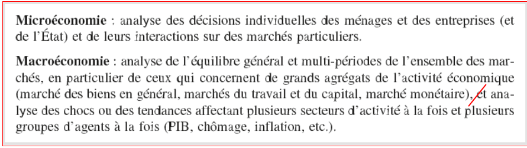
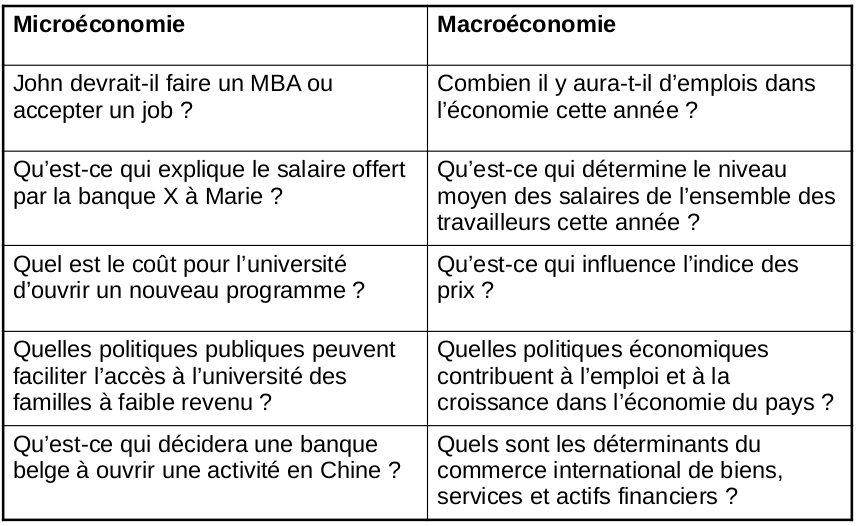
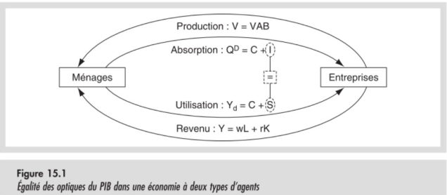
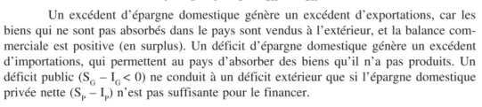
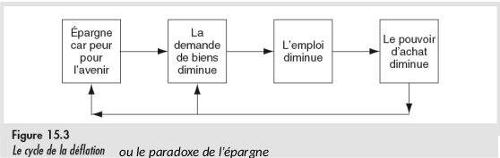
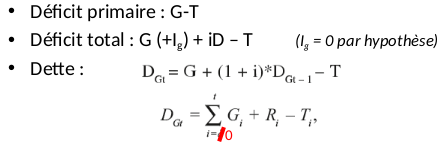

# Produit national et équilibre macroéconomique

## Questions macroéconomiques

## Origines de l'analyse macroécronomique

- Les questions monétaires.
- Rôle de l’or et autres métaux monétaires (18e et 19e siècles).
- Crises bancaires (18e et 19e siècles) + 2008.
- Les cycles d’activité.
- Découvertes, investissements, ralentissements (19e et 20e s.).
- Les dettes internationales.
- Keynes « conséquences économiques de la paix » 1919.
- Keynes « conséquences économiques de Churchill » 1925.
- Cessation de paiement du Mexique en 1982.
- L’hyperinflation.
- Allemagne 1923, Europe centrale, Amérique latine.
- Le chômage de masse, surtout dans les années 1930.
- Keynes « Théorie Générale, de l’emploi, du taux d’intérêt et de la monnaie » 1936 : Le problème de la demande et déflation.
- La crise pétrolière 1973-79.
- Le problème de l’offre et des attentes d’inflation.

Origine de la ruée vers l'or ?

Explosion de la production par la révolution industrielle, mais pas d'explosion de la quantité d'or. Echange billet de banque <> Or possible à l'époque, impression de billet limitée, car si un banque imprimait trop de billet elle se retrouvait baisée si lors d'un coup de panique les gens venaient échanger leurs billets contre de l'or.

## Particularités de la macroéconomie

- Les marchés sont interdépendants.
- L'ensemble n'est pas la somme des parties : (*ex : Un embouteillage n'est pas juste une somme de voiture, il faut aussi prendre en compte les relations entre les voitures.. Ce ne sont pas directement les voitures qui causent les bouchons, mais le fait que l'amas de voiture provoque une impossibilité de synchroniser les déplacements des voitures*), qui est à l'origine du bouchon.
- Les agrégats sont intéressants, ils peuvent être très indiquateurs sur l'état de l'économie (*ex : PIB, taux de chômage*).
- La dimension temps.
- Problèmes des ajustements qui prennent du temps (**marchés incomplets**).
- Rôle de la monnaie : transfert de pouvoir d'achat dans le temps.

## Marché des biens : PIB

### Différence entre ventes et valeurs ajoutées

L'intérêt est porté sur la valeur ajoutée

Producteur | Ventes | Achats | VAB
-----------|--------|--------|----
Agrigulteur | 0,4 | 0 | 0,4
Meunier | 0,9 | 0,4 | 0,5
Boulanger | 2 | 0,9 | 1,1

Valeur ajoutée = valeur des ventes - valeur des achats intermédiaires

### Définition du PIB

<table style="border : 3px solid red;">
<tr>
<td>Le <b>Produit intérieur brut</b> est la somme des valeurs ajoutées brutes en monnaie de tous les biens et services produits dans un pays pendant une période donnée</td>
</tr>
</table>

Dans les biens finaux, il peut y avoir des éléments qui n'ont pas été produit dans la période donnée ou dans le pays donné.

### Les quatres optiques du PIB et l'égalité entre épargne et investissement

#### Les quatres optiques de compisition du PIB

Exemple illustratif : Le boulanger de l'exemple précédent

- **Production** = V= $Q^S$ => (Valeur ajoutée par secteur) : Le PIB peut être calculé en faisant la somme des valeurs ajoutées brutes lors de toutes les étapes du processus de production, comme vu précédemment.
- Lorsque le boulanger produit du pain, il contribue à ajouter de la valeur.
- **Absorption** = A = $Q^D$ => (Destination finalle des productions) : On peut aussi calculer le PIB comme étant la somme des achats finaux des biens produits.
- Le pain que le boulanger produit va être acheté par des consommateurs.
- **Revenu** = Y => (rétribution des facteurs de production): On peut calculer le PIB en faisant la somme des revenus distribués aux facteurs de production qui ont contribués à ajouter de la valeur.
- La valeur ajouté brute de la production du bouanger premt de rémunérer les facteurs de production qui ont contribués à ajouter de la valeur.
- **Utilisation** = $Y_d$ => (usage du revenu disponible en onsommation et épargne) : On peut calculer le PIB en faisant la somme de l'épargne et des dépenses de consmmation de tous les agents.
- Les revenus d'un détenteur de facteurs de production consitutent son revenu disponible, qu'il va pouvoir utiliser à deux finalité : la consommation et l'épargne.

Ces quatres optique de calcul de PIB doivent être équivalentes.

Le PIB se calcule sur 4 agents : les ménages, les entreprises, l'Etat et le reste du monde.

#### PIB d'une économie à deux agents : ménages et entreprises

Dans cette situation, précisons que :
- Les entreprises produisent des biens et des services en créant de la valeur ajoutée.
- Les ménages achètent des biens de consommation et des biens d'inverstissement produits par les entreprises.
- Les entreprises sont locataires des moyens de production et paient aux ménages un salaire pour le travail engagé et un loyer pour le capital utilisé.
- Les ménages consomment une partie de leur revenu et en épargnent le reste.

<marquee><h5>Il est maintenant l'heure de l'Instant définitions</h5></marquee>

<table style="border : 3px solid red; box-shadow: 10px 5px 5px red;">
<tr>
<td>La <b>consommation</b> est une opération économique consistant en l'utilisation immédiate de biens ou services ui seront détruits dans ce processus.</td>
</tr>
<tr>
<td>L'<b>investissement</b> est une opération réalisée par un agent économique consistant à acquérir des moyens de production destinés à être mis en location et à servir plusieurs fois.</td>
</tr>
<tr>
<td>Le <b>revenu disponible</b> d'un agent est le montant monétaire dont il a la libre disposition pour sa consommmation et son épargne, après l'obtention des revenus des facteurs de production dont il est le détenteur et des transferts nets dont il est le bénéficiaires.</td>
</tr>
<tr>
<td>L'<b>épargne</b> est la partie du revenu disponibe qui n'est pas consommée.</td>
</tr>
</table>

<marquee><h5>C'était l'Instant définitions.</h5></marquee>

En mettant en place les optiques de calcul de PIB vues précédements :
1. **Optique de production** : $V = \sum VAB$ : Somme des valeurs ajoutées.
2. **Optique d'absorbtion de la production** : $Q^D = C + I$ : Biens de consommation (C) + Investissement (I)
3. **Optique de revenu** : $Y = wL + rK$ : Rémunération des salaires (*wL* : Salaire * Quantité de travail) + Revenus bruts de capitaux des agents (*rK* : Taux d'intérêts multipliés par le stock de capital).
4. **Optique d'utilisation du revenu disponible** : $Y_d = C + S$ : Achat de biens de consommation (C) + épargne (S)

Ces mesures sont équivalentes, et les égalités peuvent vouloir dire plusieurs choses:

- $V + Q^D$ : Tout ce qui est produit doit être absorbé.
- $V + Y$ : tout produit génère un revenu.
- $Y = Y_d$ : tout le revenu doit être alloué à quelque chose.

$Q^D = Y_d \Leftrightarrow C + S = C + I \Leftrightarrow S = I$

**S = I, l'épargne finance l'investissement.**

#### Economie à trois agents : ménages, entreprises et Etat

Il faut maintenant considérer l'Etat, qui a une activité productive (enseignement, police, justice) et une consommation (services achetés et salaires payés). Il acquiert également des biens d'investissement (des autoroutes).

En plus de cela, l'état à une fonction redistributive (allocs, pensions).

<table style="border : 3px solid red;">
<tr>
<td>Un <b>transfert</b> est un mouvement monétaire qui n'a pas de contrepartie productive, mais qui a une justification redistributive.</td>
</tr>
</table>

##### Le calcul selon les optiques

1. ***Optique de production*** : $V = \sum VAB_{mén} + VAB_{ent} + VAB_{Etat}$ : Il faut pour ce faire connaître les ventes et les achats intermédiaires de l'état. Les ventes sont calculées aux coûts de production (Salaire des fonctionnaires, ect..) auquel on retire les achats intermédiaires.
2. ***Optique d'absorption*** : $Q^D = C + G + I_P + I_G$ : Soit $G$ la consommation publique et $I_G$ l'investissement publique
3. ***Optique de revenu*** : $Y = wL + rK$ : Même expression, mais il faut compter dans $wL$ les salaires de ces glandeurs de fonctionnaires et dans $rK$ les loyers perçus par l'état.
4. ***Optique d'utilisation du revenu disponible*** : $Y_d = C + G + S_P + S_G$ : Les principales rentrées d'argents de l'Etat sont les impôts sur la personne (Taxes que paient Papa et Maman) et les impôts sur le sociétés (Taxes que paient les bourgeois). L'Etat depense $G$ et épargne $S_G$

#### Economie à quatre agents : ménages, entreprises, Etat, reste du monde

Il est maintenant nécessaire d'introduire dans les calculs les pays étrangers, qu'on appellera ici *reste du monde*. On parlera alors de ***PNB***.

Ce nouvel agent amène une nouvelle notion, **la balance**, qui sert d'indicateur pour les exportations-importations en les classant en trois catégories : les échanges de biens et services, les revenus de facteurs et les transferts courants.

La balance des biens et services : $X_{BS} - M_{BS'}$, soit
- $X$ les exportations.
- $M$ les importations.
- $BS$ désigne les Biens et service.

La balance courante : $X_{BSFT} - M_{BSFT}$, soit
- $F$ les revenus de facteurs.
- $T$ les transferts courants.

##### Le calcul selon les optiques

1. ***optique de production*** : $V = VAB_{mén} + VAB_{ent} + VAB_{Etat} + X_F - M_F$
2. ***optique d'absorbtion*** : $Q^D = C+G+I_P+I_G+X_{BSF} - M_{BSF'}$.
3. ***optique de revenu*** : $Y = wL + rK$ : On prend maintenant en compte les revenu des ressortissants du pays étudié même s'ils sont hors du pays, et on exclu les revenus des immigrés qui nous volent notre travail.
4. ***optique d'utilisation du revenu disponible*** : $Y_d = C + G + S_P + S_G$ : Par soucis de simplification, le reste du monde est absent des transferts qui distinguent le revenu disponible national du revenu primaire national.

Par l'équation obtenue en égalisant le point 2 et le point 4, on obtient: $S_P + S_G - I_P - I_G = X_{BSF} - M_{BSF'}$, et comme le dit Alain parce que j'ai la flemme de retaper ça :

### Limites du PIB

- Aucune indication sur le bien-être des habitants.
- Le PIB ignore les activités non rémunérées.
- Traitement égal entre les dépenses classiques et les dépenses curatives pour restaurer le bien-être suite à des activités destructrices (ex : *vente d'antidépresseurs*).
- Le PIB ignore la pénibilité du travail, comme la durée du temps de travail.

<!-- ##### Produit National Brut

$PNB + PIB + X_F - M_F$

- Optique de production : $V = \sum VAB$
- Optique d'absorbtion : $Q^D = C + G + I + X_{BSF} - M{BSF}$
- Optique de revenu : $Y = wL + rk + T_{i}$
- $T_i$ : Taxes indirectes.
- Optique d'utlisation du revenu disponible brut : $Y_d = C + G + S_P + S_G$ -->

## Le paradoxe de l'épargne

Nous assistons ici à une différence entre ce qui est individuellement rationnel et ce qui l'est collectivement. C'est une situation typique de la macroéconomie : *le tout n'est pas simplement la somme des parties*.

## Marché des capitaux et stabilisation de dette

### Origine de la dette

### Stabilisation  de la dette

Sans surprise, pour qu'une dette se stabilise, il faut qu'elle ne croisse pas plus vite que le PIB, ce qui donne :

$d= \frac{(D_{t+1} - D_t)}{D_t} = g = \frac{Y_{t+1} - Y_t}{Y_t}$.

Soit $d$ le taux de croissance de la dette et $g$ le taux de croissance du PIB.

Parce qu'Alain l'a dit, le taux de croissance de la dette est égal au déficit divisé par la dette:

$d = \frac{G_{t+1} + i*D_t - T_{t+1}}{D_t}$.

Et si on l'égalise avec $g$, on obtient le surplus primaire nécessaire pour stabiliser le rapport dette/PIB :

$T_{t+1} - G_{t+1} = (i - g)*D_t$.

On peut donc réduire sa dette en baissant le déficit, mais aussi en augmentant sa croissance.

## Marché du travail et chômage

Le point de vue macroéconomique différencie deux types de chômages :

- ***Le chômage cyclique*** : Chômage dépendant des fluctuations du PIB, les moments de plus grosses production nécessitant plus de travail.
- ***Le chômage structurel*** : chômage durable, considéré comme une résultante de l'organisation institutionnelle du marché, de ses réglementations, de celles du marché des biens qui interfèrent avec le marché du travail.

## Marché des échanges internationaux

Comme vu précédemment, l'épargne finance l'investissement et les exportations nettes :

$S = I + (X_{BSFT} - M_{BSFT})$

Dans le cas où où l'épargne ne suffit pas à financer l'inestissement, le pays aura un déficit extérieur tel que :

$S - I = (X_{BSFT} - M_{BSFT}) < 0$

Dans ce cas là, la dette extérieure s'accroît et on obtient :

$D_{Nt} = (X_{BSFT} - M_{BSFT}) + D_{Nt - 1}$ ou sous forme condensée $D_{Nt} = \sum_0^t (X_{BSFT} - M_{BSFT})_t$

