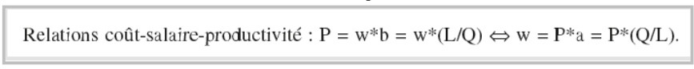
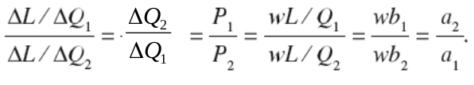
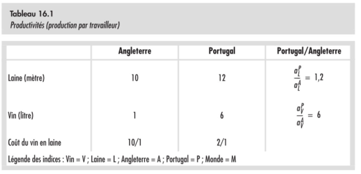
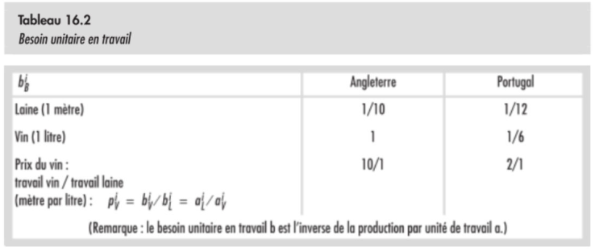
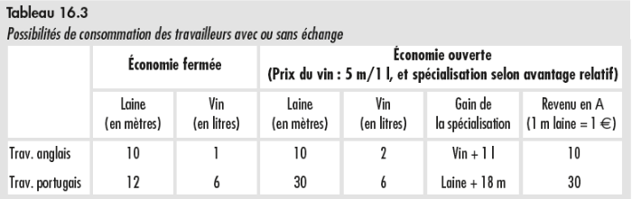

# Economie ouverte : échanges et paiements

## Production, salaire & coûts

Et on parle de besoin marginal en travail pour $\frac{\Delta L}{\Delta Q}$.

## Salaire des travailleurs et prix des biens

Soit:
- $P$ le prix du bien.
- $w$ le salaire.
- $b$ le besoin de travail vu précédemment.
- $a = \frac{1}{b}$.

Etant donné que b définit la quantité de travail consommée pour produire une unité de bien, a définit quant à lui la quantité de bien produite pour une unité de travail consommée.

## Prix relatif avec 2 biens

En prenant les mêmes paramètres qu'au point précédent, on peut trouver une relation créant un rapport entre deux biens :

Exemples d'application sur une situation concrète:

## Production et spécialisation

### Gain de l'échange

En reprennant l'exemple précédent, on peut vite constater que l'Angleterre a intérêt à vendre sa laine au Portugual, car elle pourra la vendre à 2 laines par litre de vin, contre 10 laines pour un litre si elle le vendait chez elle.

Dans la même démarche, les portuguais ont tout intérêt à vendre leur vin en Angleterre, où ils peuvent y avoir un prix de 10 mètres de laines pour 1 litre de vin contre 2 mètres de laines par litre de vin chex eux.

**Tableau des coûts**

/ | Laine (en Vin) | Vin (En Laine)
--|----------------|---------------
Angleterre | 1/10 | 10
Portugual | 1/2 | 2

La laine est donc moins chère en Angleterre et le Vin au Portugual.

Il y a ici un incitant à la spécialisation : L'Angleterre à tout intérêt à se spécialiser dans la laine alors que le Portugual devrait lui se spécialiser dans la production de Vin.

### Avantage absolu, relatif et spécialisation

<table style="border : 3px solid red;">
<tr>
<td>Un pays possède un <b>avantage absolu</b> dans la production d'un bien lorsque la productivité des travailleurs dans ce secteur est supérieure à la productivité des travailleurs étrangés dans ce même secteur.</td>
</tr>
</table>

<table style="border : 3px solid red; margin-top : 3%;">
<tr>
<td>Un pays a un <b>avantage relatif (ou comparatif)</b> pour un bien sur un autre si, pour produire ce bien, il doit renoncer à moins de production d'un autre bien que l'autre pays.</td>
</tr>
</table>

L'avantage relatif pousse à produire davantage ce qu'on fait de mieux, pour acheter ce qu'on fait le moins bien.

### Prix, revenu et pouvoir d'achat

On assiste donc ici à une situation où les deux agents on plus de possibilités de consommation grâce à l'échange, ce qui nous ramène aux premiers cours de cette année et la notion de *Gain de l'échange*.

**<u>Le prix d'un bien</u>** sera toujours compris entre deux bornes : une borne supérieure représente le prix au delà duquel un pays n'achètera pas à l'étranger car cela coûte moins cher de le produire lui-même, et une borne inférieure en deça de laquelle la marchandise vaut tellement que dalle que le pays producteur aura des avantages à se lancer dans la production d'un autre bien, plus rentable.

!!! example Exemple
L'Angleterre produit de la laine pour $\frac{1}{10}$ de litre de vin, et le Portugal $\frac{1}{2}$. Au delà de $\frac{1}{2}$ le Portugal a intérêt à produire la laine lui-même car cela lui reviendra moins cher, et en deça de $\frac{1}{10}$ l'Angleterre gagnerait plus à changer de spécialisation et à se lancer dans le vin.
