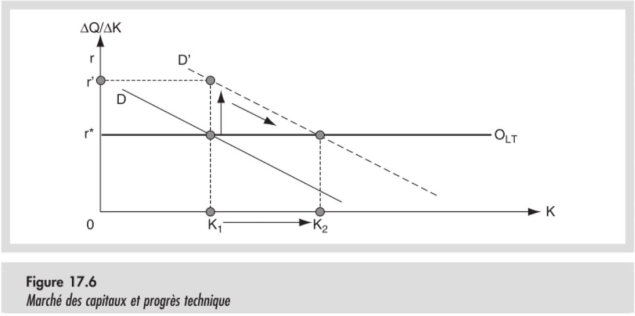

# Croissance économique

## De quoi qu'on parle donc ?

Sur ce graphique, on constate que le PIB/habitant et le Salaire/habitant augmente alors que le travail reste stabe, ainsi que les taux d'intérêts. *Mais pourquoi donc Jamy ?* Bah le but de ce chapitre c'est de te l'expliquer, ducon.

## L'optique de revenu du PIB

Comme vu précédemment : $Y = w*L + r*K$.

On peut alors déterminer des valeurs a et b telles que :
- $a = w\frac{L}{Y}$ (Part du travail dans la production).
- $b = r\frac{K}{Y}$ (Part du capital dans la production).

Ainsi, l'équation de revenu deviens:

$\frac{Y}{Y} = w\frac{L}{Y} + b = r\frac{K}{Y} = a + b = 1$.

Dans les pays industrialisés, on tourne autour des 60% pour a et 40% pour b.

Pour faire croître le PIB, il suffit donc d'augmenter un des 4 facteurs dans l'équation de base, c'est à dire $w$, $L$, $r$ et $K$ ou trouver une amélioration technologique qui pourrait aider (Genre des supers machines qui produiront 3 fois plus vite). Mais comme l'augmentation de $w$ et $r$ est généralement induite par la production, ce serait con de vouloir les utiliser pour faire croître la production, n'est-ce pas ?

on se retrouve alors avec cette équation:

$\frac{\Delta Y}{Y} = w\frac{\Delta L}{Y} + r\frac{\Delta K}{Y} + q\frac{\Delta A}{Y}$.

!!! note Note
Le $q\frac{\Delta A}{Y}$ représente ici le progrès technique et tout est divisé par Y pour que ces pauvres économistes retrouvent leurs valeurs en pourcents, il faut les comprendre aussi, c'est compliqué les nombre décimaux.

En introduisant les parts de revenu (c'est à dire a et b, faut suivre) et en fixant $q = \frac{Y}{A}$ parce que Alain l'a dit, on obtient :

$\frac{\Delta Y}{Y} = a\frac{\Delta L}{L} + b\frac{\Delta K}{K} + \frac{\Delta A}{A}$.

(En multipliant $\Delta L$ par $\frac{L}{L}$ et $\Delta K$ par $\frac{K}{K}$)

Voilà donc les trois source de coissance du PIB, et pour augmenter ce dernier, il faut accumuler ces 3 facteurs.

## Accumulation de capital

Pour accumuler du capital afin d'augmenter le PIB, il faut pouvoir répondre à 3 contraintes :

1. ***Contrainte de productivité*** : Le rendement marginal du capital accumulé tend à être décroissant (Pour ceux qui dorment au fond, ça veut dire que la valeur que rajoute le capital au PIB tend à diminer au fil du temps).
2. ***Contrainte de création de Capital*** : Il faut pouvoir renoncer à consommer une partie de la production pour qu'elle puisse être réinvestie afin de créer plus de capital.
3. ***Contrainte de maintient du stock de capital*** : Il faut également pouvoir renoncer à de la consommation, cette fois chaque année, afin de maintenir la capacité de production.

### Petit exemple de derrière les fagots

/ | / | t | t+1 | t+2
--|---|---|-----|----
A | Production : $\frac{1}{2}K$ si K < 200, $100 + \frac{1}{10}(K - 200)$ si K > 200 | 100 | 100 | 102
B | Capital = K | 200 | 200 | 220
C | Investissement de remplacement : 5% du PIB | 10 | 10 | 11
D | Investissement net | 0 | 20 | 0
E | Consommation : A - C - D | 90 | 70 | 91

1. Comme vu au même point précédemment, la fonction de production a un rendement décroissant, ce qui implique que le capital ajouté à la production apporte de moins en moins au fur et à mesure qu'il est accumulé.
2. Il faut, à un moment, accepter de consommer moins pour épargner afin d'investir dans la production (Visible dans le tableau en E et en D au temps t + 1).
3. Il faut aussi douiller chaque année pour permettre au capital de se renouveller.

Etant donné le point 3, il est nécessaire de considérer un capital Brut, qui est le capital perçu dans son intégralité, et le salaire net, qui est le Capital auquel on a retiré les frais nécessaire à son renouvellement.

### Conditions d'accumulation du capital

On en dégage deux, qui sont :

1. Il faut que l'augmentation du capital soit supérieure à l'augmentation des coûts de renouvellement du même capital.
2. Il faut que l'augmentation du capital soit suffisante que pour justifier l'épargne pour le provoquer (Il est con de demander à quelqu'un de se priver de 350287502O75€ sur un mois pour que ses revenus puissent augmenter de 0,00001 %).

## Contribution et limites du facteur de travail

### Production par habitant et par travailleur

Le produit marginal du travail est décroissant, ce qui veut dire que plus on a de travailleur, plus l'impact d'un travailleur sur la production est faible.

On mesure la capacité d'un pays à satisfaire la consommation de ses habitants par la production par habitant ($\frac{Y}{N}$) et la productivité est quant à elle mesurée en production par travailleur ($\frac{Y}{L}$).

Etant donné que tout les habitants ne participent pas à la production, $\frac{Y}{N} < \frac{Y}{L}$. Du coup, il devient cool de se pencher sur la production par travailleur (Parce que les branleurs d'étudiants, on s'en branle). Sa croissance, notée $\frac{\frac{\Delta Y}{L}}{\frac{Y}{L}}$ se calcule comme :

$\frac{\frac{\Delta Y}{L}}{\frac{Y}{L}} = \frac{\Delta Y}{Y} - \frac{\Delta L}{L} = (a - 1)\frac{\Delta L}{L} + b\frac{\Delta K}{K} + \frac{\Delta A}{A} = (1 - a)(\frac{\Delta K}{K} - \frac{\Delta L}{L}) + \frac{\Delta A}{A}$.

## Contribution du progrès technique

Pour le calculer, c'est tout con :

$\frac{\Delta Y}{Y} = a\frac{\Delta L}{L} + b\frac{\Delta K}{K} + \frac{\Delta A}{A} \Rightarrow \frac{\Delta A}{A} = \frac{\Delta Y}{Y} - a\frac{\Delta L}{L} - b\frac{\Delta K}{K}$.

### Interpétation graphique

#### Pour le Capital

<table class="table_show">
<tr>
<td></td>
<td></td>
</tr>
</table>

Je n'ai pas réussi à raccourcir le texte d'Alain. Pour une fois ça a l'air concis :

#### Pour le travail

<table class="table_show">
<tr>
<td></td>
<td></td>
</tr>
</table>

Dans le cas d'une offre de travail inélastique (La quantité de travail n'augmente pas), ce sont les salaires qui augmentent.
