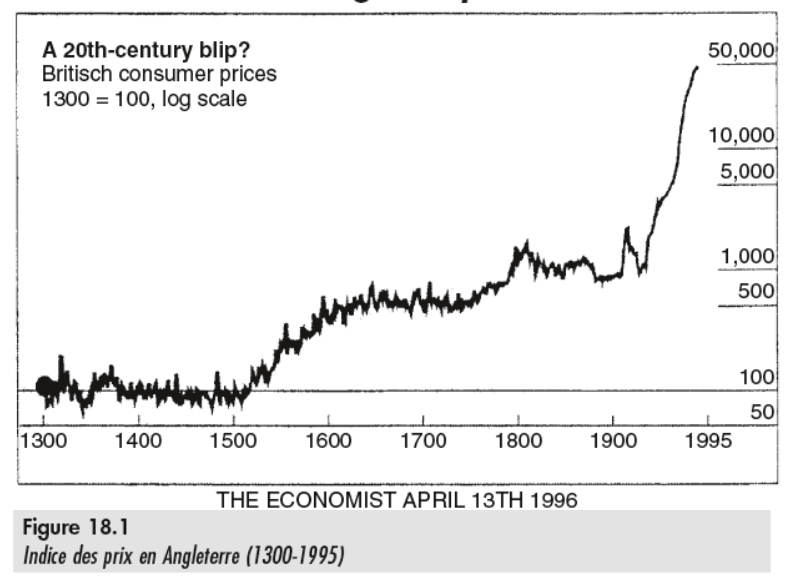

# Marché monétaire et bancaire

## Monnaie, échanges et prix

- **1500** : arrivée d'or des amériques.
- **1750-1800** : Mise en circulation des billets de banque.
- **WWI et WWII** : Hausse des prix suite à l'impression intensive de billets et endetements liés à la guerre.
- **1945** : Fin de la convertibilité de la monnaie en or, la monnaie devient fiduciaire.

Ces situations correspondent à une augmentation rapide des moyens de paiement. La stabilité du XIXème siècle sur le graphique correspond alors à la révolution industrielle qui aura vu la production exploser sans que les moyens de paiement n'explosent également.

**Rappels**

*Taux d'inflation* : $\pi_t = \frac{P_t - P_{t-1}}{P_{t-1}}$.

Il faut marquer la différence entre le moment où tout les prix varient, ce qui dépend de la quantité de monnaie et de marchandises disponible et le moment où le prix d'un bien augmente, ce qui dépend de l'offre/demande du bien.

## Demande de monnaie

### Pourquoi avoir de la monnaie ?

<table class="table_red">
<td>La <b>monnaie</b> est définie comme un bien accepté par tous, en particulier par l'Etat, comme moyen de paiement et transactions et d'extinction des dettes.</td>
</table>

- **Transaction** : Payer des trucs, comme des pizzas à 5€ de chez Pizza Pronto à Saint-Servais.
- **Précaution** : Retirer de l'argent liquide pour pouvoir payer en cas de problème (ex: Lors d'un voyage).
- **Spéculation** : Conserver son argent en attendant que les prix baissent (ex : Attendre que le dernier Iphone coûte moins cher).

### Graphique

(Voix d'enfant innocent) : *Et mais pourquoi la courbe elle descend ?*

Bonne question Billy ! Parce que lorsque les taux d'intérêts (ex: Les $\frac{1}{100000}$ d'euros que ta banque verse sur ton compte tout les 10 ans) sont élevés, tu as plutôt intérêt à mettre ton argent en banque plutôt que de planquer ton argent sous ton matelas. Et lorsque les taux d'intérêts sont ridiculement bas, tu auras propbablement envie de garder ton argent près de toi pour dormir avec car de toute façon tu ne gagnerais rien à le mettre en banque.

### Mouvements de la courbe

Les facteurs qui peuvent déplacer la courbe se comptent au nombre de 3 :

- **Le niveau général des prix** (P) : Si tout les prix augmentent, on va avoir besoin de plus de monnaie.

    !!! warning Attention, attention
        Quand on dit que le prix global des prix augmente, c'est la demande de monnaie **nominale** qui augmente. La valeur réelle demandée reste la même.

- **La quantité de biens achetés** (Q) : Cela suit l'objectif de transaction, c'est plutôt obvious.
- **Le coût de conversion des richesses** (b) :  ¯\\_(ツ)_/¯

On note alors la courbe de demande : $M^D(i,P,Q,b)$

### Vélocité de la monnaie

<table class="table_red">
<tr>
<td>La <b>vélocité de la monnaie</b> se définit comme le nombre d'usages par unité de temps d'un ensemble donné de signes monétaires.</td>
</tr>
</table>

Elle fait patie de l'équation $PQ = MV$ tel que

- $P$ les prix moyens, et $Q$ les quantités moyennes produites.
  - Donc $PQ = PIB$
- $M$ la masse monétaire.
- $V$ el famoso vélocité.

## Offre de monnaie

### Formes de monaies

<!-- Jump 3.3 -->

### Multiplicateur de crédit et monaie scripturale

<table class="table_red">

<td>Le <b>multiplicateur de crédit</b> se définit comme le rapport entre les moyens de paiement totaux en circulation, y compris les dépôts créés par les pêts des banque commerciales, et la monnaie de base émise par la banque centrale.</td>

</table>

En soit, ça met en avant le dilemme des banques. Une banque doit bien pouvoir gérer l'argent qu'elle met en circulation pour éviter de voir tout ses clients débarquer au même moment pour réclamer leur argents sans que la banque ne soit en mesure de le leur donner.

!!! example Exemple
    Le trio de choc Roger, Nadia et Kévin mettent 50€ chacun sur leur compte en banque chez Delzottius. Le super manager de la banque Delzottius se dit "*chouette, j'ai 150€ à claquer dans des canettes d'Ice-Tea au deuxième étage de la fac info !*". Sauf que s'il fait ça, il remet les 150€ en circulation, et le trio de choc doit toujours pouvoir utiliser ses 50€ chacun. Ce qui crée une différence entre les moyens de paiment effectifs en circulation et la masse monétaire.

$M$ = Moyens de paiement créés.
 
$H$ = Monnaie de réserve.
 
$u$ = coefficient de réserve.
 
$m$ = Multiplicateur de crédit.
 
 
$H = u*M$
 
$m = \frac{M}{H}$
 
$M = H*(\frac{1}{u})= m*H$

### Les fonctions d'offre

<table>
<td></td>
<td></td>
</table>

Le taux d'intérêt est fixé par la BCE car elle décide de l'offre (Normal, c'est elle qui imprime), ce qui fait qu'en vrai, la courbe d'offre est quasi inélastique.

## Equilibre du marché

### Mouvements de l'offre

### Neutralité de la monnaie

La neutralité de la monnaie (M) est une théorie qui dit que la quantité de monnaie en circulation n’a aucun effet sur l’activité économique (Q).

- **Non-neutralité** : les agents achètent des titres et la baisse de taux d’intérêt stimule l’activité d’investissement productif (I) et augmente la production (Keynes).
- **Neutralité** : les agents achètent des biens, mais l’offre inélastique de biens conduit à une hausse de prix, sans hausse de production (Friedman).

## Politique monétaire

### Objectif

- Stabilité des prix (inflation de 2%).
- Stabilité des banques (Origine première des Banques Centrales).
- Soutien de l'activité économique et de l'emploi.
- Soutien des objectifs de l'UE.
