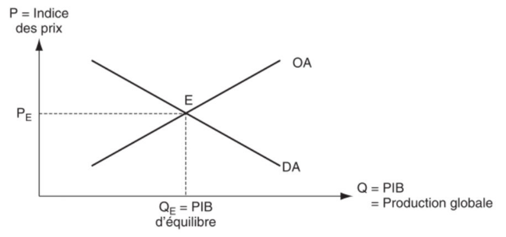
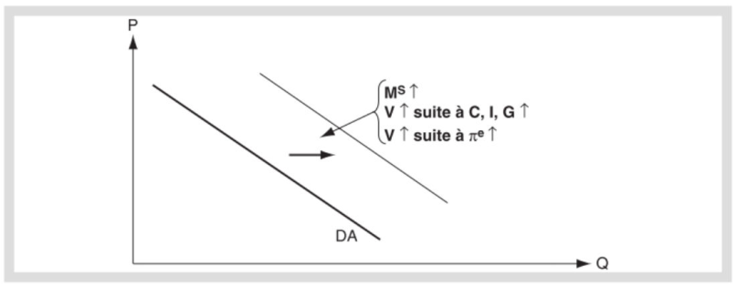
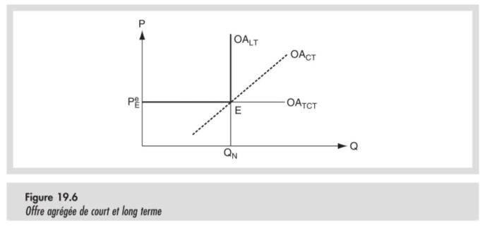
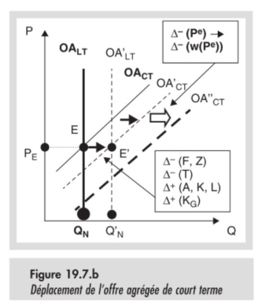
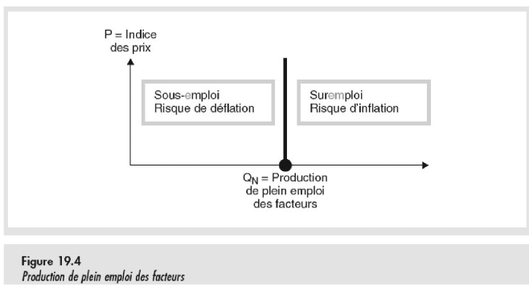
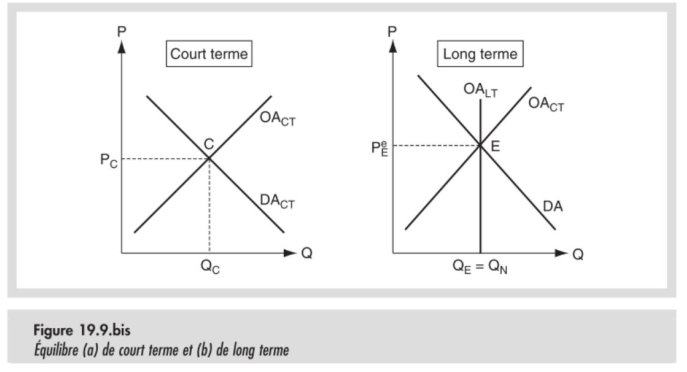
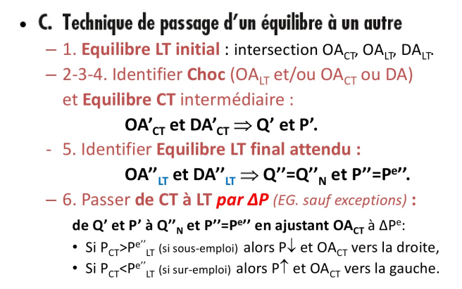

# Offre et demande agrégée

## Modèle de base

<table class="table_red">
<tr>
<td>La <b>demande agrégée</b> représente les possibilités d'absorption de biens à prix donnés, TACEPA.</td>
</tr>
<tr>
<td>L'<b>offre agrégée</b> représente les possibilités de fournir de biens à prix donnés, TACEPA.</td>
</tr>
</table>

### Pentes des courbes

Il est intéressant de préciser que les pentes ne représentent plus les mêmes choses que celles des fonctions d'offres et de demandes à l'échelle macroéconomique. Ici, la pente de la demande représente la disponibilité de moyens de paiement et celle de l'offre reflète la disponibilité à fournir des biens.

## Demande agrégée

### Construction

La **fonction de demande agrégée** représente la quantité produite (*et donc le PIB*) comme une fonction de :
- L'indice des prix.
- La masse monétaire.
- La vélocité de la monnaie.
- Des composantes d'absorbtion.
- Le taux de change e.
- Le taux d'intrêt i.
- L'évolution attendue des prix.
- Et bien d'autres ...

Si on veut une notation mathématique inutile, ça donne:

$DA:Q = Q^{D} = (P,M,i,e,P^e,...)$

### Pente

La pente négative de la demande peut se justifier par l'équation $PQ = MV$. A Masse monétaire et Vélocité donnée, une relation inverse entre P et Q s'impose. Une augmentation des prix provoque une diminution de la Quantité absorbable et une baisse de ces mêmes prix implique une augmentation de la capacité d'absorbtion.

### Déplacements de la courbe

Cela est très bien expliqué par l'exercice 3 du dernier TP :)

## Offre agrégée

### Construction

La **fonction d'offre agrégée** représente la quantité produite (*et donc le PIB*) comme une fonction de :
- L'indice des prix.
- Le coût réel du travail.
- L'avancement technologique.
- L'évolution attendue des prix.
- Et bien d'autres ...

Si on veut une notation mathématique inutile, ça donne:

$OA:Q = Q^{S} = (P,w,A,P^e,...)$

!!! 
    Moi ? Du copié/collé ? Naaaaaan

### Pentes

*On notera le s à pentes*

Il existe trois sortes de demande agrégée, caractérisées par des pentes différentes:
- L'offre agrégée de très court terme.
  - Elle possède une pente infiniment élastique, car les prix mettent du temps à évoluer et ne varient pas à très court terme.
- L'offre agrégée de court terme.
  - Elle possède quant à elle des prix et des quantité de bien mis à disposition partiellement variables, ce qui lui donnera une pente random.
- L'offre agrégée de long terme.
    - On suppose que sur le long terme, la production est à son niveau optimum, ce qui induit une pente totalement inélastique.

Graphiquement, ça donne ça :

### Mouvements de la courbe

L'exercice 5 du dernier TP est vraiment bien fait quand-même ! Mais sinon on peut analyser les déplacements par type de courbe d'offre agrégée.

Pour l'**offre de long terme**, les facteurs influent sont :
- L'accumulation de facteurs de production.
- La qualité des biens publiques.
- La pression fiscale.
- Le savoir faire technologique.
- Le pouvoir de négotiation des travailleurs.
- Le pouvoir de marché des producteurs.

Pour ce qui est du **court terme**, les modifications de l'offre de long terme l'impacte également. Ce qui est bien sûr logique (et heureusement...) car un modification sur le long terme implique forcément une modification sur le court terme.

Néanmoins, l'inverse n'est pas vrai, et il existe des modifications qui ne sont que temporaires et qui ne s'appliquent pas à l'offre de long terme. En même temps, c'est tout l'intérêt davoir des courbes différentes...

C'est le cas de l'anticipation du niveau général des prix, qui peut déplacer la courbe de court terme. Je ne vais pas insérer de graphique pour ne pas surcharger, mais vous pouvez imaginer une droite qui se déplace vers le haut où vers le bas. Voilà c'est très bien !

### Plein emploi

L'offre agrégée de long terme induit maintenant un niveau de production optimal. Une telle production implique l'emploi du nombre nécessaire de travailleur. Au delà, il y en aurait trop pour la capacité productive, en deça il n'y en aurait pas assez. C'est cette quantité d'équilibre qui sera notée $Q_N$ &nbsp;

## Equilibre macroéconomique

Sur le court terme, une certaine quantité est échangée, sans que cela ne corresponde nécessairement au plein emploi, et est notée $Q_C$. Sur le long terme, la production est à son optimum, noté $Q_N$.

### Modification de l'équilibre macroéconomique

Nous remercierons Alain pour sa recette miracle pour répondre à ce problème :

### Chocs d'offre et de demandes

Référez-vous au dernier TPs et éventuellement à d'autre excercices (ex : Corrigé d'examen) pour pouvoir comprendre les mouvements de courbes et leurs méchanismes. Il faut faire joujou avec les courbes pour les comprendre.

!!! quote Alain de Crombrugghe <insérer titre de noblesse ici>
    L'économie, ça s'étudie avec du papier et un crayon !

